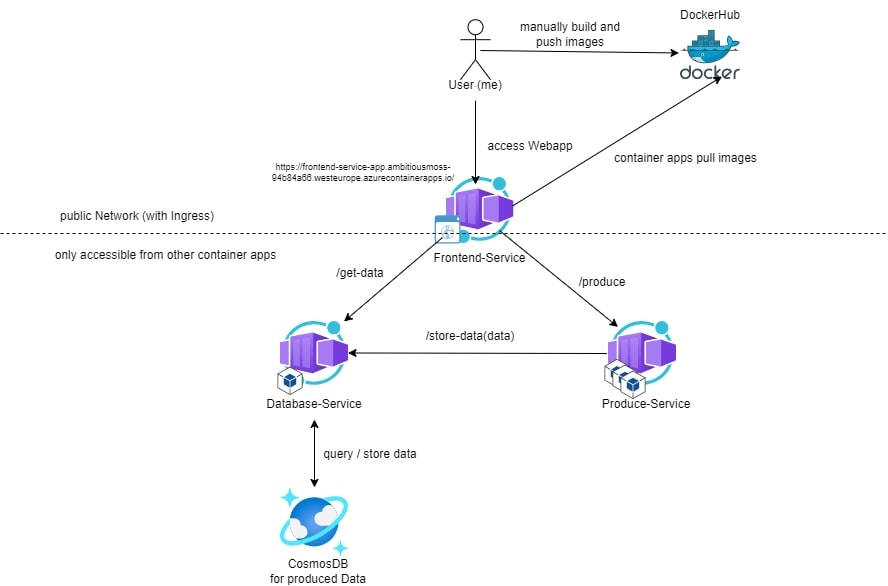
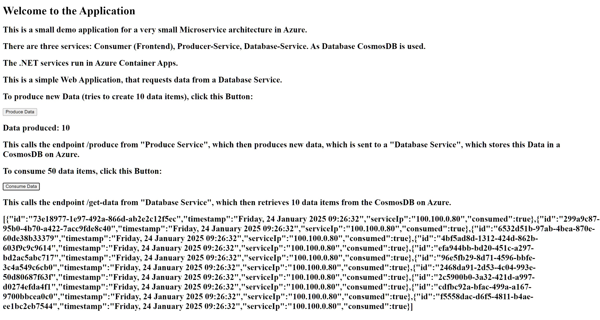

# producer-consumer-azure-demo
### Name: Philipp Olivotto, StudentID: k12223453

This is a produce-consumer demo with a frontend, deployed in Azure, following a small microservice architecture  (3 services). 
This is done as an exercise.

This example deploys 3 .NET services into Azure Container Apps,
which connect to a CosmosDB for data storing.

The application consists of 3 (micro-)services:
- Frontend Service (Blazor .NET): retrieves data from the database service, and requests the producer to produce more data
- Produce Service (.NET): produces data and sends it to the database service
- Database Service (.NET): Connects to a CosmosDB NoSQL DB and queries and stores data.

The code of this simple services is in this repository (see the corresponding folders).

See this simple architecture diagram for an overview:

## Setup Process
This is not a complete step-by-step setup process but shows most steps, but misses out on some minor details. 

### 1. Create a CosmosDB (NoSQL) via the Azure Portal
1. Search for Cosmos DB in the portal.
2. First create a CosmosDB account. 
3. Resource Group (new): "produce-consumer-cluster_group" with some account name. Otherwise default settings.
4. Now click on Create and create a 'Azure Cosmos DB for NoSQL'. (mostly use default settings)
5. After its created, create a Database with the Database Id "Produce-Consume-DB".
6. In there we create a Container with container Id "produce-consume-container-1" with partition key "/id".
7. In the `Keys` section of our CosmosDB account we find connection parameters. Note down the URI and the primary key.

Now we have a running DB in CosmosDB with a Container to store data.

### 2. Create the Container Apps
Each Service has their own Dockerfile to create an image.
I pushed the images to DockerHub (could also use Azure's registry).

URL Endpoints (as DNS to the services) are hardcoded in the code, therefore we have dependencies and need to adjust code.
Produce needs the URI of the Database-Service.
Frontend needs the URI of the Produce-Service and the Database-Service.
It would be better to handle this in another way (i.e. environment variables).

Create the image for the database service and push it to DockerHub (in my case: zbaaakez/db-service-image:latest).
1. Database Service (Container App):
    - Mostly default settings.
    - Set 'database-service-app' as Container App Name.
    - Set DockerHub as image registry and set the image 'zbaaakez/db-service-image:latest'.
    - Set environment variables (values exist from database creation): ('CosmosDb__EndpointUri', 'CosmosDb__PrimaryKey', 'CosmosDb__DatabaseId', 'CosmosDb__ContainerId')
      (Note: the PrimaryKey should be stored in a secret!)
    - Enable Ingress (for Container Apps in this environment only) and set 8080 as target port.
    - Create the App.

In the Overview of the database-service-app Container App we get the URI of the service.
In the Producer Service we have to change one line of code to match this URI.

Now create the image for the produce service and push it to DockerHub (in my case: zbaaakez/produce-service-image:latest).

2. Produce Service (Container App):
    - Mostly default settings.
    - Set 'produce-service-app' as Container App Name.
    - Set DockerHub as image registry and set the image 'zbaaakez/produce-service-image:latest'.
    - Enable Ingress (for Container Apps in this environment only) and set 8080 as target port.
    - Create the App.
    - Scale it to 3 minimum replicas. So we will see that the produced data can come from different replicas. (The produced data includes the local IP of the pod)

In the Overview of the produce-service-app Container App we get the URI of the service.
In the Frontend Service we have to change two lines of code to match the URIs of the Database Service and Produce Service.

Now create the image for the frontend service and push it to DockerHub (in my case: zbaaakez/frontend-service-image:latest).

3. Frontend-Service
   - Mostly default settings.
   - Set 'frontend-service-app' as Container App Name.
   - Set DockerHub as image registry and set the image 'zbaaakez/frontend-service-image:latest'.
   - Enable Ingress and select 'Accept traffic from anywhere' (Target Port: 8080). This is done, so the frontend is accessible by the web.
   - Create the App.

Find the URI to the Frontend-Service in the Overview of the frontend-service-app.

## Access the Application
We can use the URI of the previous step to access the application.
In my case that is: https://frontend-service-app.ambitiousmoss-94b84a66.westeurope.azurecontainerapps.io

Feel free to play around (as long as this is online).

## What's (could be) next? / Lessons Learned
A lot of manual steps are needed -> CI/CD (with GitHub Actions,...).

Azure Container Apps seem powerful but a new thing to learn, maybe an AKS Cluster would have been fine.
But the setup of the services with Container Apps worked without big problems for this example.

The application is pretty useless and boring, but for a small azure example it is fine.

Compared to GCP, Azure felt more complex with way more features. But I would need to dig deeper into them both to confirm this.

## Example Overview
Example Flow:
Click "Produce Data" Button on Website -> calls "/produce" of the Produce Service
"/produce" produces 10 data items and sends each of them to "/store-data" of the Database Service.
The Database services stores the data items to the CosmosDB container.
"/produce" returns the number of successful data items that were produced.
The frontend shows how many data items were produced.

Click "Consume Data" Button on Website -> calls "/get-data" of the Database service.
The Database service retrieves the 10 oldest data items WHERE consumed = false (if possible -> otherwise less data items).
The data items that were consumed are updated to consumed = true by the Database service.
The Database service returns the data items (as List).
The frontend services shows the JSON data.

Website example:

